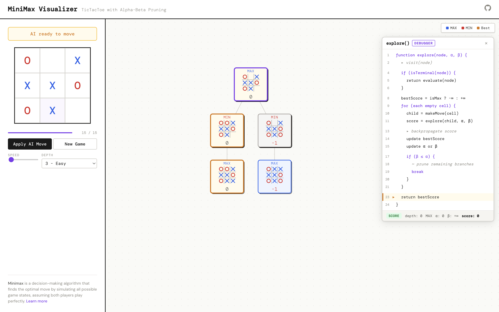

# MiniMax Visualizer

An interactive TicTacToe game that visualizes the MiniMax algorithm with alpha-beta pruning in real-time.



## Features

- Play TicTacToe against a MiniMax AI
- Watch the decision tree build step-by-step
- Adjustable search depth (Easy → Unbeatable)
- Play/pause/step controls for the visualization
- Pan and zoom the tree

## Getting Started

```bash
pnpm install
pnpm dev
```

## Tech Stack

React, TypeScript, Zustand, react-d3-tree, Vite
